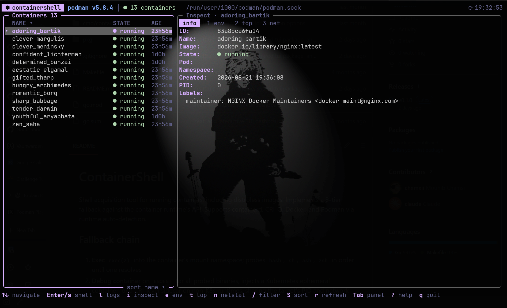

# ContainerShell

Shell acquisition tool for running containers, including distroless images. Implements a 3-tier fallback against the container runtime's API. Supports containerd, CRI-O, Docker, and Podman via runtime auto-detection.




## Fallback chain

1. **Exec** `exec(2)` into the container's mount namespace; probes `bash`, `sh`, `ash`, `zsh` in order until one resolves
2. **Debug container** on `ENOENT` for all probed binaries, injects a Kubernetes ephemeral container, or a CRI-level sidecar on non-K8s runtimes, sharing the target's PID and network namespaces
3. **Nsenter** if the runtime rejects the sidecar injection, attaches directly to the container's `pid`, `mnt`, `net`, `uts`, and `ipc` namespaces from the host via `setns(2)`; requires `CAP_SYS_ADMIN`

## Install

### From a release binary (recommended)

No Go toolchain needed. Grab the latest tarball for your platform from the
[releases page](https://github.com/chxmxii/containershell/releases), or:

```bash
VERSION=v0.1.5                                              # latest release
OS=$(uname -s | tr '[:upper:]' '[:lower:]')                 # linux / darwin
ARCH=$(uname -m | sed 's/x86_64/amd64/;s/aarch64/arm64/')   # amd64 / arm64
curl -sL "https://github.com/chxmxii/containershell/releases/download/${VERSION}/containershell-${VERSION}-${OS}-${ARCH}.tar.gz" | tar xz
sudo install "containershell-${VERSION}-${OS}-${ARCH}/containershell" /usr/local/bin/
containershell --version
```

Each release ships `checksums.txt` with SHA-256 sums for verification.

### From source

Requires Go 1.25+.

```bash
git clone https://github.com/chxmxii/containershell.git
cd containershell && make build && sudo make install
```

## Usage

```bash
# full-screen interactive dashboard (aliases: ui, tui)
containershell dashboard

# shell straight into a container
containershell --name nginx
containershell --pod web-pod --namespace prod
containershell --runtime docker --name myapp
```

The dashboard shows a live container list with filtering (`/`), sorting (`S`),
per-container inspect/env/processes/network tabs, log and debug overlays, and
one-key shell access (`Enter`). Press `?` inside for the full key map.

### Themes

Press `T` in the dashboard to open the theme selector — moving the cursor
previews each theme live, `Enter` applies and saves it, `Esc` cancels. Built-in
themes: `catppuccin` (default), `dracula`, `nord`, `gruvbox`, `tokyo-night`;
each adapts to light and dark terminal backgrounds. The chosen theme is
persisted to `~/.config/containershell/theme` and can be overridden per run:

```bash
containershell dashboard --theme nord
```

## Debug toolkit

Each subcommand operates on the resolved container's namespaces or cgroup directly.

```bash
containershell logs --follow --tail 50
containershell inspect
containershell top
containershell env
containershell netstat
containershell tcpdump -i eth0 -c 100
containershell strace --follow-forks
containershell fs --path /app --recursive
containershell cp --dir from --src /etc/hosts --dst ./hosts
containershell cp --dir to   --src ./config.yaml --dst /app/
containershell portfw --local 8080 --remote 80
```
All commands accept `--name`, `--pod`, `--namespace`, `--container-id`. No target → interactive picker.

### Short flags

| Long | Short | | Long | Short |
|---|---|---|---|---|
| `--runtime` | `-r` | | `--verbose` | `-v` |
| `--socket` | `-s` | | `--version` | `-V` |
| `--name` | `-n` | | `--help` | `-h` |

`-n` is `--name` (container name), not `--namespace`. Within `fs`/`portfw`, `-R` is `--recursive`/`--remote` (`-r` is reserved globally for `--runtime`).

## Runtimes

| Runtime | API | Default socket |
|---|---|---|
| containerd | CRI / containerd API | `/run/containerd/containerd.sock` |
| CRI-O | CRI | `/var/run/crio/crio.sock` |
| Docker | Docker Engine API | `/var/run/docker.sock` |
| Podman | libpod API | `/run/podman/podman.sock` |

Auto-detection resolves the socket in this order:

1. `--socket` flag (accepts a path or a URL: `unix://`, `tcp://`, `ssh://`)
2. `DOCKER_HOST` / `CONTAINER_HOST` environment variables
3. Well-known socket paths, including Docker Desktop (`~/.docker/run/docker.sock`) and rootless sockets under `$XDG_RUNTIME_DIR`

Set `DOCKER_HOST` when your daemon listens on a non-default path, e.g.
`DOCKER_HOST=unix:///custom/path/docker.sock` or `DOCKER_HOST=tcp://10.0.0.5:2375`.

When `--runtime` is left on `auto` and several runtimes are available at once
(e.g. Docker *and* Podman), containershell uses the only one when there is a
single match, prompts you to choose on an interactive terminal, and otherwise
falls back to the highest-priority match. Pass `--runtime docker|podman|cri`
(`-r`) to select one directly and skip the prompt.

## Completions

```bash
source <(containershell completion bash)
source <(containershell completion zsh)
containershell completion fish | source
```

## Build

```bash
make build   # build with version info
make test    # run tests
make lint     # golangci-lint
make install # install to /usr/local/bin
make clean   # remove binary
```

## License
MIT
